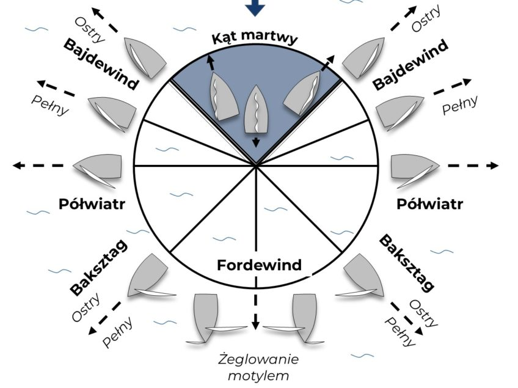

# Gra mobilna – "Łódka"

## Wprowadzenie
Aplikacja "Łódka" to symulacja interaktywnego żeglowania, w której użytkownik steruje kierunkiem łódki, a jej prędkość zależy od wiatru. Realistyczny model fizyki oddaje wpływ warunków atmosferycznych na ruch jednostki pływającej, co stanowi wyzwanie dla gracza.

## Spis Treści
- [Najważniejsze funkcje](#najważniejsze-funkcje)
- [Technologie użyte w aplikacji](#technologie-użyte-w-aplikacji)
- [Instalacja i uruchomienie](#instalacja-i-uruchomienie)
- [Mechanika gry](#mechanika-gry)
- [Wpływ wiatru](#wpływ-wiatru)
- [Interakcja użytkownika](#interakcja-użytkownika)
- [Elementy mechaniki aplikacji](#elementy-mechaniki-aplikacji)
- [Przyszłe usprawnienia](#przyszłe-usprawnienia)
- [Kontakt](#kontakt)

## Najważniejsze funkcje
- **Symulacja żeglowania** – ruch łódki oparty na realistycznym modelu fizyki. ```jakim modelu fizyki, co mam zaimplementować?```
- **Sterowanie kierunkiem** – użytkownik może obracać łódką, ale jej prędkość zależy od wiatru. ```mam pytanie w jakich osiach obracać, w ilu wymiarach, jaka jest zależność prędkości od wiatru?```
- **Dynamiczna zmiana warunków pogodowych** – losowo generowany wiatr o różnych kierunkach i intensywności. ```interesuje mnie jak będzie przebiegało losowanie```
- **Realistyczne oddziaływanie wiatru** – różne efekty w zależności od kąta natarcia wiatru na żagle. ```jakie różne efekty??```
- **Prosty i intuicyjny interfejs** – przyciski umożliwiające kontrolę nad łódką. ```czy intuicyjny interfejs jest funkcją?```

```powyższe jest dobrym etapem na opracowanie konkretnych przypadków uzycia```

## Technologie użyte w aplikacji
- **.NET MAUI** – platforma do tworzenia aplikacji mobilnych.

## Instalacja i uruchomienie
Aby zainstalować aplikację, wykonaj następujące kroki:

```bash
w trakcie budowy
```

## Mechanika gry
Łódka nie porusza się samodzielnie – jej prędkość jest zależna od wiatru. Użytkownik może jedynie sterować kierunkiem łódki (obracając ją w lewo lub w prawo). ```czym ją obraca?```

## Wpływ wiatru
Siła i kierunek wiatru mają kluczowy wpływ na ruch łódki:
- **Wiatr w żagle (z tyłu)** – maksymalna prędkość łódki.
- **Wiatr boczny** – umiarkowana prędkość i konieczność dostosowania kursu.
- **Wiatr czołowy** – zatrzymuje łódkę, wymuszając zmianę kierunku.



Kierunek wiatru jest losowo zmieniany w czasie rzeczywistym. Może on przybierać następujące wartości:
- **Północ (N)**
- **Południe (S)**
- **Wschód (E)**
- **Zachód (W)**
- **Kierunki pośrednie (NE, NW, SE, SW)**

## Interakcja użytkownika
- **Obracanie łódki** – zmiana kierunku poruszania w lewo lub w prawo.
- **Obserwacja zmian wiatru** – dostosowanie kursu do warunków pogodowych.
- **Reakcja na zmieniające się warunki** – planowanie manewrów na podstawie siły i kierunku wiatru.

## Elementy mechaniki aplikacji
Aby aplikacja poprawnie działała, konieczne są następujące elementy:
- **Model fizyczny** – symulacja wpływu wiatru na ruch łódki, bezwładność jednostki. ```liczę na implementację w programie tych parametrów```
- **Generator wiatru** – algorytm losujący kierunek i siłę wiatru w różnych odstępach czasu.
- **System sterowania** – przyciski zmieniające kierunek łódki, ale bez kontroli nad żaglami. ```to wyjaśniło moje wcześniejsze pytanie```
- **Model łódki** - graficzny model łódki, który się obraca.
- **Silnik gry** – obsługa logiki aplikacji, interakcji użytkownika i dynamiki ruchu.

## Przyszłe usprawnienia
- Wprowadzenie efektów wizualnych dla fal i odbić światła.
- Optymalizacja wydajności silnika symulacyjnego.
- Dodanie trybu multiplayer.

## Kontakt
Wszelkie pytania i sugestie prosimy kierować na adres e-mail: **kontakt@lodka-mobile.pl**.

```Założenia aplikacji były inne, nie mamy tu uwzglęnionego ustawiania żagla zależnie od kierunku wiatru i kierunku w którym płynie łódka. Nie mamy wyjaśnień jak dokonać tych obliczeń. Nie mamy też funkcjonalności informującej z jakim wiatrem płyniemy np. baksztag.```

